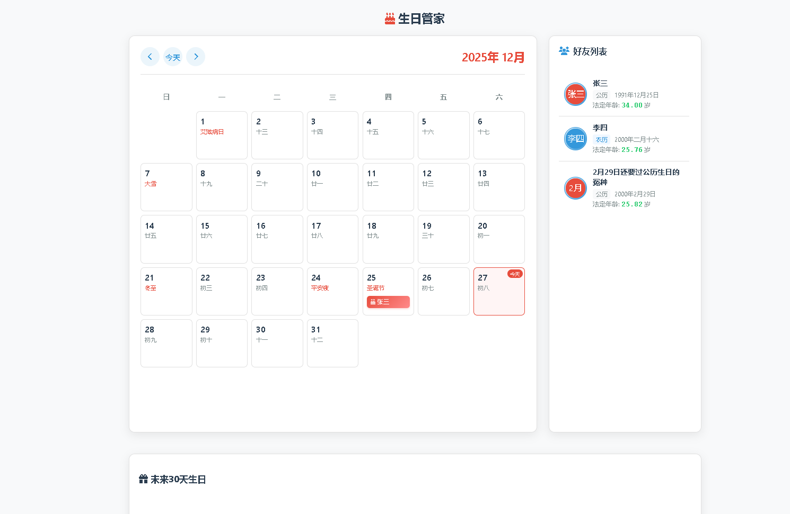

# 🎂 生日管家 (Birthday Manager)

**一个清新、现代化的本地生日追踪看板，支持公历与农历，精准计算年龄，绝不泄露隐私。**

   

## 📸 界面预览

 

## ✨ 主要功能

*   **📅 双历支持**：完美支持 **公历 (阳历)** 和 **农历 (阴历)** 生日，自动转换无需操心。
*   **🔢 精准年龄**：实时计算精确到小数点后两位的年龄（例如：25.43岁）。
*   **🎉 节日提醒**：日历集成中国传统节日与二十四节气。
*   **📱 PWA 支持**：支持安装到手机桌面，像原生 App 一样使用（需通过 Python 服务器启动）。
*   **🎈 庆祝动画**：生日当天自动触发全屏庆祝特效与彩带动画。
*   **🔒 隐私安全**：所有数据存储在本地 `json` 文件中，无需联网，无需数据库。
*   **🛠️ 傻瓜式管理**：附带 Python 脚本，通过简单的菜单操作即可添加、修改好友信息。

---

## 📥 下载与安装 (傻瓜式教程)

即使你没有任何编程基础，也可以轻松使用本项目。

### 第一步：下载项目
请前往本项目页面右侧的 **[Releases (发行版)](../../releases)** 页面：
1. 找到最新的版本（Latest）。
2. 点击下载 `Source code (zip)` 或打包好的压缩包。
3. 将下载的压缩包解压到你电脑上的任意位置（比如桌面的“生日管家”文件夹）。

### 第二步：安装 Python (如果电脑里没有)
为了能够方便地编辑生日信息和启动网站，你需要安装 Python。
1. 访问 [Python 官网下载页面](https://www.python.org/downloads/)。
2. 下载最新版 Python 安装包。
3. **⚠️ 重要：** 安装时务必勾选 **"Add Python to PATH"** (将 Python 添加到环境变量)。
4. 一路点击 "Install Now" 完成安装。

---

## 🚀 如何使用

### 1. 添加与管理好友 (零代码操作)
我们提供了一个简单的管理工具，让你不用去改复杂的代码。

1. 进入你解压后的文件夹。
2. 找到 `images` 文件夹，把你朋友的头像图片丢进去（建议正方形图片）。
3. 双击运行 **`编辑生日信息.py`**。
   * 如果双击没反应，请右键选择“打开方式” -> “Python”。
4. 你会看到一个黑色窗口（命令行界面），根据提示输入数字即可：
   * 输入 `1` 进入修改模式 -> 选择 `1` 添加新记录。
   * 按照提示输入姓名、生日（格式 1990-01-01）、选择是否农历、选择头像。
   * 完成后记得选择保存。

### 2. 启动查看 (推荐方式)
为了获得最佳体验（包括手机端支持和图标显示），建议使用自带的启动脚本。

1. 双击运行 **`启动网站.py`**。
2. 程序会自动打开你的默认浏览器，并展示生日管家界面。
3. **手机访问**：如果你的手机和电脑连在同一个 WiFi 下，在手机浏览器输入电脑的 IP 地址加端口号（例如 `192.168.1.5:8000`）即可访问。

*(直接双击 `index.html` 打开无法正常工作。)*

---

## 📂 文件结构说明

*   `index.html`: 网站主程序，界面核心。
*   `birthdays.json`: 存储所有好友生日数据的数据库文件。
*   `编辑生日信息.py`: 用于增删改查生日数据的管理工具。
*   `启动网站.py`: 一个轻量级的 Web 服务器，用于正确运行网站。
*   `images/`: 存放好友头像的文件夹。
*   `icon-192.png` / `manifest.json`: PWA 配置文件，用于手机安装。

---

## ⚠️ 注意事项

1. **农历设置**：在添加生日时，请输入该好友的**公历出生日期**，如果选择了“是”过农历生日，系统会根据出生日期自动计算每年的农历生日。
2. **头像显示**：如果没有设置头像，系统会自动生成一个包含名字首字母的默认头像。
3. **数据备份**：建议定期备份 `birthdays.json` 文件，以免误删。

---

## 🤝 贡献与致谢

本项目凝聚了多方的创意与努力：

*   **创意构思**：[@胡思乱想Hero](https://space.bilibili.com/470347297)
*   **核心开发**：[@Gemini-3-Pro](https://aistudio.google.com)，[@DeepSeek-v3.2](https://chat.deepseek.com)

## 📝 许可证 (License)

本项目采用 **MIT License** 许可证。

你可以免费使用、复制、修改、合并、出版发行、散布、再授权及贩售本软件及其副本。
